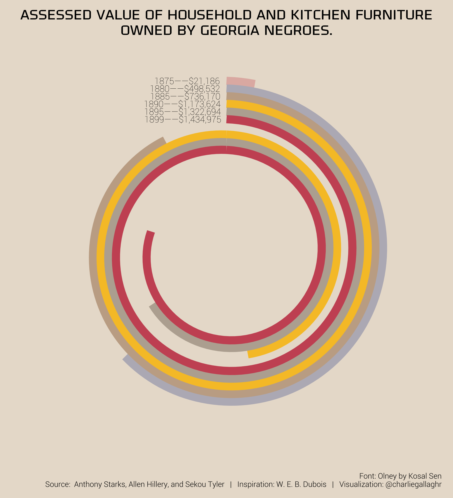

```{r setup, include=FALSE}
knitr::opts_chunk$set(echo = TRUE, message = FALSE)
```

For #TidyTuesday this week, I imitated W.E.B. Du Bois's graphic on furniture value for black families. Here's is mine next to the original: 




I recreated this with several goals in mind: 

1. Plot the data with nearly-properly proportioned bars
2. Use `coord_polar`
3. Imitate the look and feel of the original

Du Bois's design is nice. He handles the always-present challenge with parallel bars in polar coordinates: in polar coordinates, the circumference of a bar depends on its distance from the origin. He solves this by grouping his bars close together and far from the origin. Even within the spiral, the bars remain fairly far out. 

## A Spiral
A spiral is a sloping line or series of lines in polar coordinates. I'm going to build it from pieces. 

A horizontal line in polar coordinates is a circle.

```{r}
library(tidyverse)
```


```{r}
ggplot() + 
  geom_line(aes(x = c(0, 10), y = 5)) + 
  coord_polar()
```

A sloping line is a spiral with one revolution.

```{r}
ggplot() + 
  geom_line(aes(x = c(0, 10), y = c(5, 1))) + 
  coord_polar()
```


You can change the y limits to affect where the spiral revolution ends. 

```{r}
ggplot() + 
  geom_line(aes(x = c(0, 10), y = c(5, 1))) + 
  coord_polar() + 
  ylim(c(-5, 5))
```

Stitch together several downward sloping lines so that the end of one is always the start of the other, but at opposite sides of the x-axis. 

```{r}
df <- tibble(
  x = rep(c(0, 10), 5),
  y = rep(10:5, each = 2)[2:11],
  g = rep(1:5, each = 2)
)

ggplot(df, aes(x = x, y = y, group = g)) + 
  geom_line()

ggplot(df, aes(x = x, y = y, group = g)) + 
  geom_line() + 
  coord_polar() + 
  ylim(c(0, 10))
```


## Making the W.E.B. Du Bois Graphic
```{r}
furniture <- readr::read_csv('https://raw.githubusercontent.com/rfordatascience/tidytuesday/master/data/2021/2021-02-16/furniture.csv')
names(furniture) <- c('year', 'value')
```

Here is what we're after.

```{r, echo=FALSE}
rev_val <- 800000

fur <- furniture %>% 
  # Expand into two observations per revolution per year
  group_by_all() %>% 
  summarize(
    rev = 1:ceiling(value / rev_val)
  ) %>% 
  group_by_all() %>% 
  summarize(
    x = c(0, value)
  ) %>% 
  ungroup() %>% 
  
  # Generate x and y values
  mutate(
    # Two useful values
    rem = x - (rev_val * rev),  # Remaining value
    ring = max(rev) - rev + 1,  # Which revolution (counting from outside)
    
    # x, based on rem
    x = case_when(
      x == 0 ~ 0,
      rem > 0 ~ rev_val,
      rem < 0 ~ x - (rev_val * (rev - 1))
    ),
    
    # y, based on ring
    y = case_when(
      x == 0 ~ as.numeric(ring),
      x == rev_val ~ ring - 1,
      TRUE ~ ring - (x / rev_val)
    ),
    
    # Shift lines so they don't overlap
    new_year = replace(year, year == 1899, 1900),
    y = y + ((1887 - new_year) / 30)
  )

ggplot(fur, aes(x = x, y = y, group = interaction(rev, year))) + 
  geom_line()

ggplot(fur, aes(x = x, y = y, group = interaction(rev, year))) + 
  geom_line() + 
  coord_polar() + 
  ylim(c(-2, 2.4))
```


The spiral is made of close, parallel, spiraling lines, an extension of the technique above. This is made more complicated by the fact that the lines have different lengths, and they spiral with different numbers of revolutions. There are only two revolutions, so you could do this by hand, but I wanted to be able to set any range for the x-xis. 

What is the range of the x-axis? I chose 800,000 to begin with, and ultimately to get the red line close to its final position in the original graphic. 

Let's look at the data. 

```{r}
furniture
```

It can be useful to generalize things. I sometimes prototype my datasets to make them easier to build. Here, the basic unit is the year, and based on what we know about how to construct spirals the prototype year should look like this: 

```
year        value           x           y
18xx            z           0      or - 0
18xx            z         rev      or - 1
18xx            z           0      or - 1
18xx            z         rev      or - 2
...           ...         ...         ...
18xx            z           0           1
18xx            z   rev - rem      1 - (x / rev)
```

`rev` is the range of each revolution, `rem` is a sort of remainder, and `or` is the position of the outermost ring, whatever that happens to be. There will be one of these blocks for each year. 

Here is some of the information we'll need:

- Range of the x-axis, or the value of exactly one revolution
- Number of revolutions each `year` will have to make
- Maximum number of revolutions needed
- Amount of `value` that remains after plotting one revolution for a year


`rev_val` is going to be the range of one revolution. We need to know how many revolutions each year is going to make. This is given by `ceil(value / rev_val)`. We can make one observation for each revolution with `seq(1, ceil(value / rev_val))`. After this, the data looks like this: 

```{r}
rev_val <- 800000

fur <- furniture %>% 
  group_by_all() %>% 
  summarize(
    rev = 1:ceiling(value / rev_val)
  )

fur
```

This is a nice little trick I use a lot with the `summarize` function. The output does not have to be a scalar value, it can be a vector of any length. (Actually, it can a scalar, a vector, _or_ a `data.frame`, which adds several columns at once.)

Continuing on, for each revolution we will have a line that goes from zero to some value on the x-axis (less than or equal to `rev_val` depending on whether the line is making a full revolution). For now, we can use a placeholder value, `value`. 

```{r}
fur <- fur %>% 
  group_by_all() %>% 
  summarize(
    x = c(0, value)
  ) %>% 
  ungroup()

fur
```


Now we have the correct number of observations for each year, but we don't have x or y values. This gets a little hairy with the conditions that have to be handled, but if you break it down it's not so bad. 

First, I'll add two useful variables: `rem` and `ring`. The ring is the Nth revolution counting from the outermost to the innermost, so `ring = max(rev) - rev + 1)`. Then, `rem` is the amount of `value` that's left by the Nth ring. Every revolution covers either `rev_val` or something less than `rev_val`, if it's a partial revolution. `rem` is the result of subtracting `rev_val` from `value` once for each revolution until `rem` is negative. A negative value of `rem` indicates we can't make a full revolution. 

For `x`, the zeros can remain zeros, but the placeholders will all have to change. When `rem` is positive, we can make a full revolution, so `x` should be  `rev_val`. If `rem` is negative, we cannot make a revolution, so we use whatever is left. 

Whenever `x` is zero, `y = ring`. These are the maximum y-values. But the minimum y-values depend on whether we make a full-revolution or not. I've decided that the change in `y` is 1 across a full revolution -- this helps with partials. When we make a full revolution, `y = ring - 1`. When we don't make a full revolution, our change in `y` is directly proportional to the change in `x`; hence, we get `ring - (x / rev_val)`. By this point, our `x` values will be correct (and our placeholders gone) so we can be sure that full revolutions will have `x == rev_val` and partial rings will have `x < rev_val`. 

```{r}
fur <- fur %>% 
  mutate(
    rem = x - (rev_val * rev),
    ring = max(rev) - rev + 1,
    x = case_when(
      x == 0 ~ 0,
      rem > 0 ~ rev_val,
      rem < 0 ~ x - (rev_val * (rev - 1))
    ),
    y = case_when(
      x == 0 ~ as.numeric(ring),
      x == rev_val ~ ring - 1,
      TRUE ~ ring - (x / rev_val)
    )
  )

fur
```


This is almost complete, but our y-values are all overlapping. By using the `year` variable, we have a shortcut to add or subtract a little bit to shift each line. 


```{r}
fur <- fur %>% 
  mutate(
    new_year = replace(year, year == 1899, 1900),
    y = y + ((1887 - new_year) / 30)
  )
```


With this, the architecture is set up. All that's left is the text, which is just right-justified text at the initial y-values of the spirals. But I'll ignore this for now. 

```{r}
ggplot(fur, aes(x = x, y = y, group = interaction(year, rev))) + 
  geom_line()


ggplot(fur, aes(x = x, y = y, group = interaction(year, rev))) + 
  geom_line() + 
  coord_polar() + 
  ylim(c(-2, 2.4))
```

When we change the value of `rev_val`, we don't need to change anything else. I also combine everything and add some comments, but all I'm changing is the value of `rev_val`. 

```{r}
# CHANGE REV_VAL TO 200,000
rev_val <- 200000

fur <- furniture %>% 
  # Expand into two observations per revolution per year
  group_by_all() %>% 
  summarize(
    rev = 1:ceiling(value / rev_val)
  ) %>% 
  group_by_all() %>% 
  summarize(
    x = c(0, value)  # Placeholders
  ) %>% 
  ungroup() %>% 
  
  # Generate x and y values
  mutate(
    # Two useful values
    rem = x - (rev_val * rev),  # Remaining value
    ring = max(rev) - rev + 1,  # Which revolution (counting from outside)
    
    # x and y values
    x = case_when(
      x == 0 ~ 0,
      rem > 0 ~ rev_val,
      rem < 0 ~ x - (rev_val * (rev - 1))
    ),
    y = case_when(
      x == 0 ~ as.numeric(ring),
      x == rev_val ~ ring - 1,
      TRUE ~ ring - (x / rev_val)
    ),
    
    # Shift lines so they don't overlap
    new_year = replace(year, year == 1899, 1900),
    y = y + ((1887 - new_year) / 30)
  )


ggplot(fur, aes(x = x, y = y, group = interaction(rev, year))) + 
  geom_line()

ggplot(fur, aes(x = x, y = y, group = interaction(rev, year))) + 
  geom_line() + 
  coord_polar() + 
  ylim(c(-2, 8.4))
```


# Conclusion
This is a bespoke graphic that I've tried to make fairly general. Sure, I could go further by improving the last step, where I offset the lines a little. This depends on the value of `year`, but you could easily map it to the number of revolutions and the range of the y-axis, for example. Also, the `ylim()` parameter has to be reset by hand every time you change the value of `rev_val`, but that also could be gotten from the y-values in the data.

But the more you automate, the less you can tweak. By changing the constant `z` in the expression `y + ((1887 - new_year) / z)` (used to shift the lines), you can customize how close or far apart the lines are. By adjusting the `ylim()` parameter by hand, you can control how close to the origin you let the spirals get. So this is where I've left it. 


--- 
Charlie Gallagher, 2021

